<div style="text-align:center;font-size:2em;font-weight:bold">中国科学技术大学计算机学院</div>

<div style="text-align:center;font-size:2em;font-weight:bold">《数据库系统实验报告》</div>


<div style="display: flex;flex-direction: column;align-items: center;font-size:2em">
<div>
<p>实验题目：银行管理系统设计与实现</p>
<p>学生姓名：李宇哲</p>
<p>学生学号：PB21111653</p>
<p>完成时间：2024年6月11日</p>
</div>
</div>


<div style="page-break-after:always"></div>

## 需求分析

涉及：银行信息、客户信息、账户信息、贷款信息、银行部门信息、员工信息等相关实体

### 功能需求

- 银行及相关信息管理：银行需要有多个分行，监控每个支行的资产

- 客户管理：提供客户所有信息的 增、删、改、查功能

  如果客户存在着关联的账户或者贷款记录，客户不具有删除权限

- 账户管理：

  银行提供客户 开户、销户、修改、查询的功能

  账户包括存储账户和支票账户

  账户号是不可修改的

  有储蓄账户和信用账户两类

- 贷款管理：

  银行提供客户申请贷款和查看贷款信息的服务，一旦添加后，客户不允许修改

  同时需要提供贷款的 增、删、查功能，还有发放贷款的功能，处于发放中的贷款不允许删除

- 员工信息管理：

  员工的增、删、改、查功能，同时应该有部门经理管理部门

### 数据需求

银行可以有多个支行，每个支行位于不同的位置，且有唯一的名字。同时银行需要监管每个支行的总资产

银行的管理需要有部门和员工两个实体。每个分行有多个部门，每个部门由多个员工组成。而每个部门需要由一个部门经理管理，这可以当成员工的一个子类

部分的基本信息需要有名称和部门的类型

员工的基本信息设计员工号、还有他的一些个人信息和入职时间等

银行还需要能够开户，有存储账户和信用账户。

每个账户必备的信息是：密码，余额，开户日期和账户号

存储账户需要有利率，而信用账户需要有信用额度

银行还需要放贷，贷款需要有贷款号，本金，利率和借贷时间标识。同时还款由每笔贷款的支付情况记录，贷款支付情况由标识号、支付金额和支付日期构成

还需要有客户这个实体，客户由客户号，和一些个人信息，还有一个联系人的信息构成

#### 实体设计

- 支行（Bank）：支行名称（Primary Key），地理位置，支行总资产，支行图像

- 部门：部门号（Primary Key），部门名称，部门类型，支行名

- 员工：员工号（primary Key），身份证号，姓名，性别，联系电话，住址，入职时间

- 客户：客户号（Primary Key），客户的身份证号，姓名、性别、联系电话、家庭住址、邮箱

  唯一的联系人：联系人姓名、联系人电话，联系人邮箱、联系人关系

- 储蓄账户：存储账户号（Primary Key），密码，余额，开户日期，利率

- 信用账户：信用账户号（Primary Key），密码，余额，开户日期，信用额度

- 贷款：贷款号（Primary Key），本金，利率，借贷时间

- 贷款支付情况：支付标识号（Primary Key），支付金额、支付日期

#### 关系设计

- 包含关系：一个 支行 可以包含 多个部门，一对多联系
- 隶属关系：一个部门有多个员工，一个员工只能在一个部门，一对多联系
- 管理关系：一个部门由一个部门经理管理，一对一联系
- 开储蓄账户关系：一个支行可以开户多个储蓄账户，每个储蓄账户由一个支行开户，一对多联系
- 开信用账户关系：一个支行可以开户多个信用账户，每个信用账户由一个支行开户，一对多联系
- 发放贷款关系：一个支行可以发放多笔贷款，每笔贷款属于一个支行，一对多联系
- 贷款关系：一个客户可以有多笔贷款，一笔贷款只能属于一个客户，一对多联系
- 支付贷款关系：一个笔贷款可以有多个支付情况，一个贷款支付情况对应一笔贷款，一对多联系
- 持有信用账户关系：一位客户可以持有多个信用账户，一个信用账户隶属于一个客户，一对多联系
- 持有储蓄账户关系：一位客户可以持有多个储蓄账户，一个储蓄账户隶属于一个客户，一对多联系

## 总体设计

### 系统模块结构

>  如前端和后端两大模块

整体采用Django框架

#### 前端

使用bootstrap模版

#### 后端

采用Django框架中一些python接口，使用Mysql数据库完成数据创建插入等

### 系统工作流程

管理员启动Django后

用户登录前端UI视图，可以通过操作前端界面提供的接口，实现数据的增、删、改、查

后端Django通过html页面抓取用户的读取和输入，通过接口调用mysql语句，将数据修改体现在后端Mysql数据库中

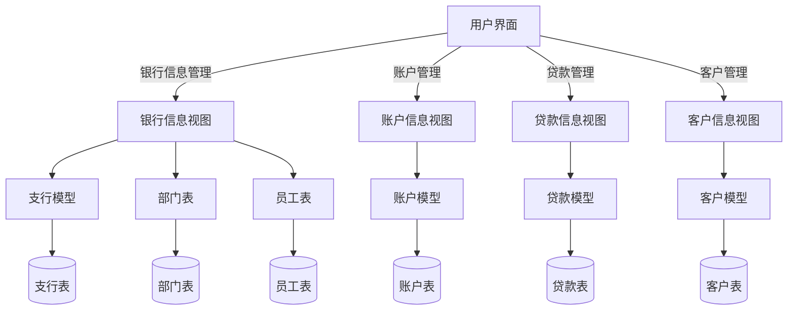


### 数据库设计

> ER图
>
> 模式分解
>
> 存储过程、触发器、函数等设计思路

#### ER图

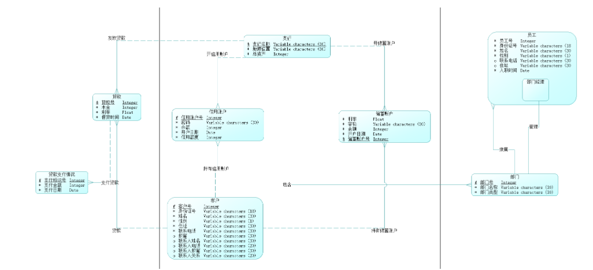

- 在支行加入了图片信息image
- 删去了经理实体子类

#### PDM图

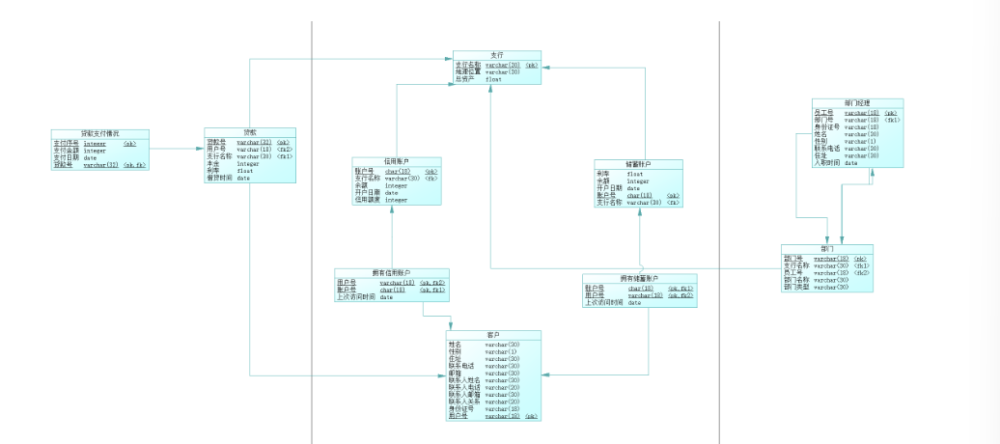

#### 存储过程

本次实验用到大量存储过程，用于各种表的增、删、改、查操作。

- 由于存储过程便于进行代码debug和维护，因此选择的大量存储过程实现

这里给出几个代表性的存储过程说明

##### 添加银行信息的存储过程

```mysql
drop procedure if exists AddBank;
delimiter //
CREATE PROCEDURE AddBank(
    IN p_bank_name VARCHAR(30),
    IN p_location VARCHAR(30),
    IN p_asset FLOAT,
    IN p_image VARCHAR(255)
)
BEGIN
    DECLARE asset_limit_reached BOOLEAN DEFAULT FALSE;

    if p_asset < 0 THEN
        set asset_limit_reached = TRUE;
    end if;

    if asset_limit_reached THEN
        SIGNAL SQLSTATE '45000'
        SET MESSAGE_TEXT = 'Bank asset cannot be negative';
    else
        INSERT INTO Bank (bank_name, location, asset, image) VALUES (p_bank_name, p_location, p_asset, p_image);
    end if;
END //
delimiter ;
```

获得输入后，检查图片路径是否存在，而后在检查合理后，插入输入数据到对应到的 Bank表中

所有的存储过程的执行流程如下

- 输入
- 检查一些条件是否满足
- 错误处理
- 执行相应的代码逻辑

#### 触发器

触发器更多用于当插入一些数据，或修改一些数据时，其他关联表项的数据修改

- 比如对于插入账户时，银行的余额要发生改变，这种操作就可以通过触发器实现

##### 银行资产更新触发器

```mysql
-- 当添加一个新的储蓄账户时，更新银行的资产
delimiter //
create trigger after_saving_account_insert
after insert on saving_account
for each row
begin
    update Bank
    set asset = asset + new.balance
    where bank_name = new.bank_name;
end ;
//
```

在插入一个新的储蓄账户时，需要将银行的资产进行更新，这个触发器是在插入操作之后执行的

#### 函数

函数设计在本次实验用的地方并不多，但可以用于获取贷款的总金额和剩余金额，因为涉及多次还款记录，因此可以用一个函数来执行相关计算

##### 剩余贷款金额函数

```mysql
CREATE FUNCTION get_remaining_loan_amount(loan_id VARCHAR(32))
RETURNS FLOAT
DETERMINISTIC
BEGIN
    DECLARE total_loan FLOAT;
    DECLARE total_paid FLOAT;
    DECLARE remaining_amount FLOAT;

    -- 获取贷款总金额
    SELECT loan_money INTO total_loan
    FROM loan
    WHERE loan.loan_id = loan_id;

    -- 获取已支付的总金额
    SELECT IFNULL(SUM(pay_money), 0) INTO total_paid
    FROM pay_loan
    WHERE pay_loan.loan_id = loan_id;

    -- 计算剩余金额
    SET remaining_amount = total_loan - total_paid;

    RETURN remaining_amount;
END//

DELIMITER ;
```

获取贷款金额，并通过 `loan_money`实体得到还款的总金额后，相减即可得到剩余金额

## 核心代码解析（可改名为对应模块，如后端实现）

### 仓库地址

> 建议使用github、gitlab、gitee等代码托管网站进行开发，并在**实验验收结束前**设置为**private**，结束后改为**public**

仓库地址在github开源 https://github.com/XZQshiyu/Database

### 目录

> 使用tree命令获取文件结构，并在文件名后用 "-------注释" 解释文件功能

lab2

- BankSystem
  - BankDatabase
    - urls.py	------路径索引
    - views.py  ------ 视图函数，定义Django接口，也是核心代码部分
    - ...
  - BankSystem
    - views.py ------视图函数，定义登录接口和index接口
    - urls.py ------ 外层路径索引
    - settings,py ------定义一些系统信息，比如数据库的账户接入等
    - ...
  - media ------ 图片存储路径
  - sql ------相关sql代码文件，需要将其在本地mysql执行
    - account.sql 
    - bank.sql
    - client.sql
    - create.sql
    - department.sql
    - employee.sql
    - insert_data.sql
    - loan.sql
    - trigger.sql
  - templates ------模版文件夹，下有各个页面的html文件
  - manage.py ------Django框架提供的一个命令行工具

> 分为若干个标题，以一定逻辑顺序讲解代码，如按ER图实体、关系讲解数据库建模代码，按存储过程、触发器分类讲解代码、按前端实现、接口等讲解前端代码
>
> 注意不要无脑粘贴代码，选取具有代表性的代码讲解，并注明文件来源，如首行注释: // backend\models.py

### 代码解析

总代码量在3000-4000行左右，这里只选取部分代码进行介绍，大题代码逻辑相似度比较高

我将以**用户管理**这个功能为例，讲解相关的代码实现，其余是三个功能模块类似

#### 用户管理界面

首先需要在 `views.py`定义相关视图函数接口，用于相应 来自html的用户输入和按键等相应

用户登录页面之后，首先在用户管理这个界面中显示所有的客户实体，用一个html页面渲染，因此需要定义相关函数

```python
# BankDatabase\views.py
def client_management(request):
    with connection.cursor() as cursor:
        cursor.callproc('get_all_clients')
        results = cursor.fetchall()
    return render(request, "client/client_management.html", {"clients": results})
```

- 当接收到用户的一个请求request后，通过django中提供的`callproc`接口调用mysql中的存储过程，然后通过游标的`fetchall`获取所有的输出
- 将相关输出存入results后，通过`render`渲染一个新的hmtl页面，并将`results`这些从数据库中取出的数据作为参数传递

相应的html页面如下

```html
<!-- templates\clinet\client_management.html -->
<div class="container">
    <div class="row">
        <div class="col-md-12">
            <h1 class="mt-4">客户管理</h1>
            <div class="d-flex justify-content-end mb-3">
                <a class="btn btn-primary me-2" href="/banksystem/add_client">添加用户</a>
                <a class="btn btn-danger me-2" href="/banksystem/delete_client">删除用户</a>
                <a class="btn btn-warning me-2" href="/banksystem/modify_client">修改用户信息</a>
                <a class="btn btn-success" href="/banksystem/search_client">查询用户</a>
            </div>
            <div id="userTable" class="table-responsive">
                <table class="table table-striped">
                    <thead>
                        <tr>
                            <th>客户ID</th>
                            <th>姓名</th>
                            <th>性别</th>
                            <th>联系电话</th>
                            <th>操作</th>
                        </tr>
                    </thead>
                    <tbody>
                        <!-- 这里将显示所有客户信息 -->
                        
                        <tr>
                            <td>{{ client.0 }}</td>
                            <td>{{ client.2 }}</td>
                            <td>{{ client.3 }}</td>
                            <td>{{ client.5 }}</td>
                            <td>
                                <a href="" class="btn btn-info btn-sm">查看</a>
                                <a href="" class="btn btn-warning btn-sm">修改</a>
                                <a href="" class="btn btn-danger btn-sm">删除</a>
                            </td>
                        </tr>
                        
                        <!-- 更多客户信息可以添加到这里 -->
                    </tbody>
                </table>
            </div>
        </div>
    </div>
</div>
```

通过bootstrap中的container容器将相应表格显示，并在每一列最后加入其他的按钮，用于定向到相关的功能

- 查看
- 膝盖
- 删除

每个页面的表头等信息这里不做代码的展示

对于Django框架，同样需要设置相关路径，用于当用户访问某个具体路径，和页面切换时与响应的接口函数对应，这部分代码定义在`urls.py`文件中

```python
# BankDatabase\urls.py
path("client/", views.client_management, name="client"),
path("add_client/", views.client_add, name="add_client"),
path("delete_client", views.delete_client, name="delete_client"),
path("modify_client", views.modify_client, name="modify_client"),
path("search_client", views.search_client, name="search_client"),
path("detail_client", views.client_detail, name="detail_client"),
path('detail_client/<str:client_id>/', views.client_detail, name='detail_client'),
path('delete_client/<str:client_id>/', views.delete_client_detail, name='delete_client'),
path('modify_client/<str:client_id>/', views.modify_client_detail, name='modify_client'),
```

这里定义了几乎所有的client相关路径和对应views中实体的接口

当用户重定向到一个具体的路径后，django会将urls.py中的路径通过`path`函数与对应views的接口对应，执行相关接口函数

下面是上述`views.py`中执行的具体sql存储过程

```mysql
-- BankSystem\sql\client.sql
-- 查看用户具体信息存储过程
DROP PROCEDURE IF EXISTS get_client_detail;
DELIMITER //
CREATE PROCEDURE get_client_detail(
    IN p_client_id VARCHAR(18)
)
BEGIN
    SELECT client_id, id, name, sex, address, phone, email, contact_name, contact_phone, contact_email, contact_relation
    FROM client
    WHERE client_id = p_client_id;
END //
DELIMITER ;
```

其余部分的功能和实现大同小异，基本遵循

- urls添加路径信息和views函数接口对应
- 实现`views.py`接口，通过存储过程或执行sql代码访问mysql数据库，取回数据，渲染相关html页面
- 实现html页面
- 在mysql中执行相关代码，加入mysql

的流程

下面将再给出一个具体的功能实现，`add_client`的相关逻辑

#### 添加用户

首先定义接口路径

```python
// BankDatabase\urls.py
 path("add_client/", views.client_add, name="add_client"),
```

实现相关`views.py`中的逻辑

```python
# 客户添加
def client_add(request):
    if request.method == 'POST':
        # 获取表单数据
        client_id = request.POST.get('client_id')
        id_number = request.POST.get('id')
        name = request.POST.get('name')
        sex = request.POST.get('sex')
        address = request.POST.get('address')
        phone = request.POST.get('phone')
        email = request.POST.get('email')
        contact_name = request.POST.get('contact_name')
        contact_phone = request.POST.get('contact_phone')
        contact_email = request.POST.get('contact_email')
        contact_relation = request.POST.get('contact_relation')

        #初始化错误信息
        errors = {}

        # 检查id，要求为正整数
        if not client_id:
            errors['client_id'] = 'id 不能为空'
        else:
            try:
                client_id = int(client_id)
                if client_id <= 0:
                    errors['client_id'] = 'id必须是正整数'
            except ValueError:
                errors['client_id'] = 'id 必须是正整数'
        
        # 检查身份证
        if not id_number:
            errors['id_number'] = '身份证不能为空'
        
        # 检查姓名
        if not name:
            errors['name'] = '姓名不能为空'
        # 检查性别
        if sex not in ['男', '女']:
            errors['sex'] = "请认真填写性别"
        # 检查地址
        if not address:
            errors['address'] = '地址不能为空' 
        if not phone:
            errors['phone'] = '联系方式不能为空'
        if not email:
            errors['email'] = '邮箱不能为空'
        if not contact_name:
            errors['contact_name'] = '联系人名字不能为空'
        if not contact_phone:
            errors['contact_phone'] = '联系人电话不能为空'
        if not contact_relation:
            errors['contact_relation'] = '联系人关系不能为空'
        if not contact_email:
            errors['contact_email'] = '联系人邮箱不能为空'
        
        # 调用存储过程
        with connection.cursor() as cursor:
            err = ''
            cursor.callproc('add_client', [client_id, id_number, name, sex, address, phone, email, 
                contact_name, contact_phone, contact_email, contact_relation, err
            ])
            cursor.execute('SELECT @_add_client_11')
            err = cursor.fetchone()[0]
            print(err)
            if err:
                errors['database'] = 'err'
                return render(request, "client/add_client.html", {"errors": errors})
            else:
                return redirect(reverse("banksystem:client"))
    return render(request, "client/add_client.html")
```

通过request获取用户输入后，检查输入是否合法

如果合法，调用存储过户车呢个 ，并通过 fechone获得返回值

在成功添加之后，重定向到 `clinet`页面中，给用户展示新的信息

添加失败后，显示失败原因，并回到当前页面要求用户重新输入

添加用户的sql语句如下

```mysql
-- 添加用户 存储过程
drop procedure if exists add_client;
delimiter //
create procedure add_client(
    in p_client_id varchar(18),
    in p_id varchar(18),
    in p_name varchar(30),
    in p_sex varchar(1),
    in p_address varchar(30),
    in p_phone varchar(30),
    in p_email varchar(30),
    in p_contact_name varchar(30),
    in p_contact_phone varchar(20),
    in p_contact_email varchar(30),
    in p_contact_relation varchar(20),
    out p_error varchar(255)
)
begin
    declare exit handler for sqlexception
    begin
        set p_error = 'Error occurred while adding client.';
        rollback;
    end;

    start transaction;

    insert into client (client_id, id, name, sex, address, phone, email,contact_name, contact_phone, contact_email, contact_relation)
    values (p_client_id, p_id, p_name, p_sex, p_address, p_phone, p_email, p_contact_name, p_contact_phone, p_contact_email, p_contact_relation);

    commit;
    set p_error = '';
end //
delimiter;
```

对应html页面代码比较长，这里就不展示了

## 实验与测试

### 依赖

> 所需的库、运行环境

复现所需实验环境

- django库
- pymysql

>可以通过pip下载
>
>- pip install django
>- pip install pymysql
>
>其余基础库如果遇到相关报错库缺失自行下载即可，我在这次实验之前的运行环境中有

#### 运行环境

windows系统

mysql workbench

bootstrap 5.1.1

python 3.11.5

Django

### 部署

> 代码运行步骤，建议使用命令行运行代码

如果是助教需要在电脑上复现，建议按照以下流程

- 将相关的所有sql文件下的文件在mysql workbench下执行，我这里并没有写一个脚本

  执行顺序：

  - create.sql
  - bank.sql, department.sql, employee.sql, account.sql, client.sql, loan.sql, trigger.sql, insert_data.sql

- 在 `BankSystem\settings.py`修改数据库为自己的信息（以下是我的信息）

  ```python
  DATABASES = {
      "default": {
          "ENGINE": "django.db.backends.mysql",
          "NAME": "banksystem",
          "HOST": "127.0.0.1",
          "PORT": 3306,
          "USER": "root",
          "PASSWORD": "Lyz791387210",
      }
  }
  ```

- 在 `.\lab2\BankSystem`路径下 执行 `python manage.py runserver 0.0.0.0:8000`

- 打开chrome或edge浏览器，输入 `127.0.0.1:8000`即可启动本数据库管理系统

###  实验结果

> 如增删改查、验证存储过程、函数、触发器、文件管理

所有详细功能已经在检查的时候给助教演示过，这里大概省略一些功能，指保留一些代表性的功能

总共实现的功能如下

- 界面展示
- 银行信息的增、删、改、查
- 银行图片的展示
- 银行下部门的增、删、改、查
- 部门下员工的增、删、改、查
- 储蓄账户的增、删、改、查
- 信用账户的增、删、改、查
- 贷款的增、删、改、查
- 贷款还款
- 用户的增、删、改、查

#### 用户登陆界面

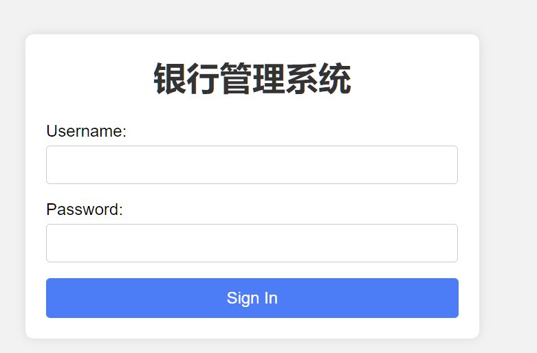

这里只提供了一份用户和密码

- 用户：lyz
- 密码：Lyz791387210

#### 基础界面

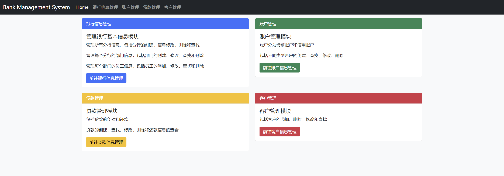

有四个基本功能模块，可以执行相应功能

#### 银行信息管理

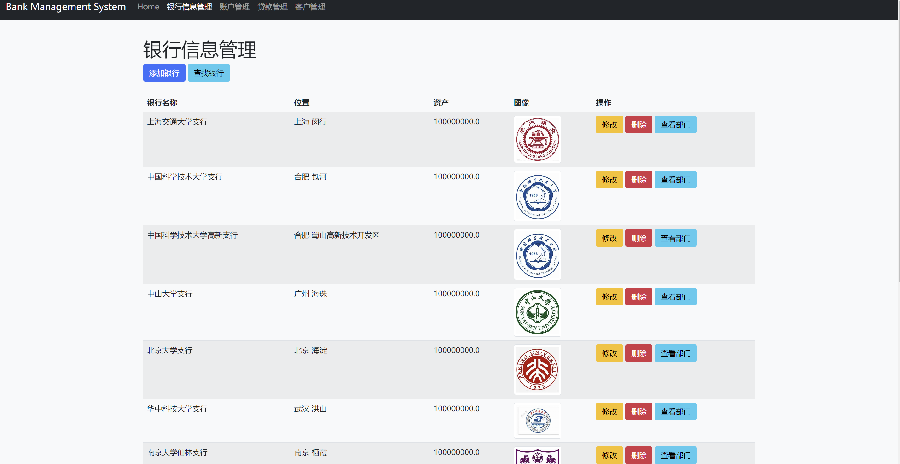

银行信息管理界面，允许添加，查看每个银行的部门，删除和修改，并支持双关键字查找（可省略部分）

##### 添加

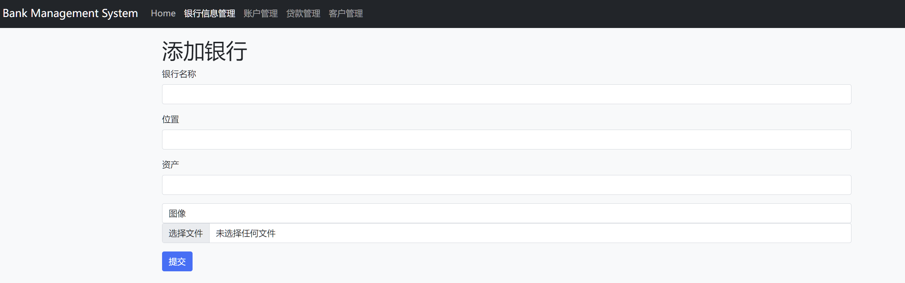

##### 查询

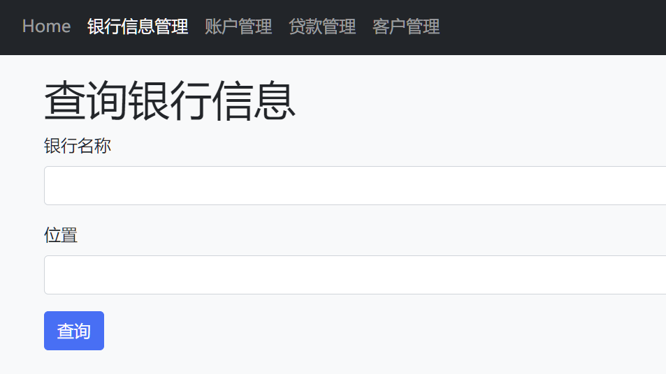

##### 修改

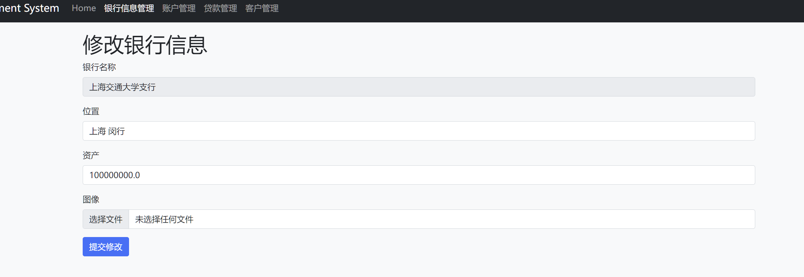

##### 部门信息管理

逻辑同银行信息管理，同时可以查看员工，员工信息管理也与前者相同

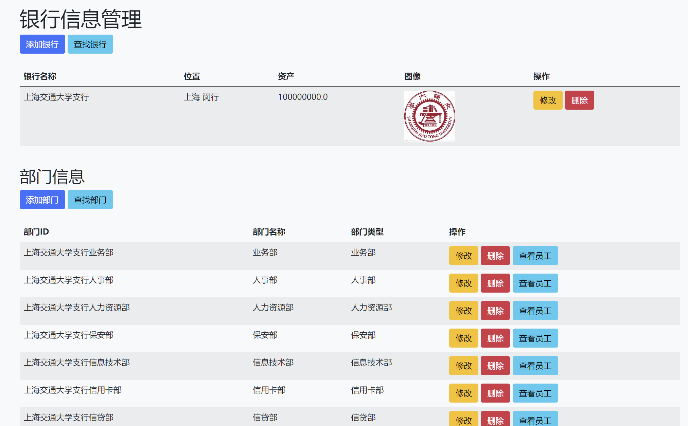

#### 账户管理

支持创建储蓄账户、信用账户和多关键字查询账户

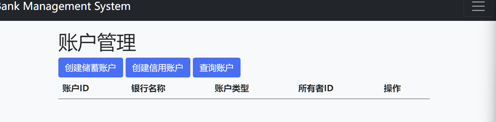

同时可以查看用户具体信息，删除和修改等

#### 贷款管理

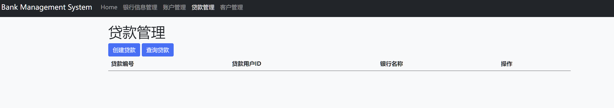

支持创建贷款，查询贷款等

对于每个贷款，可以还款，查看还款记录，修改和删除等

#### 客户管理

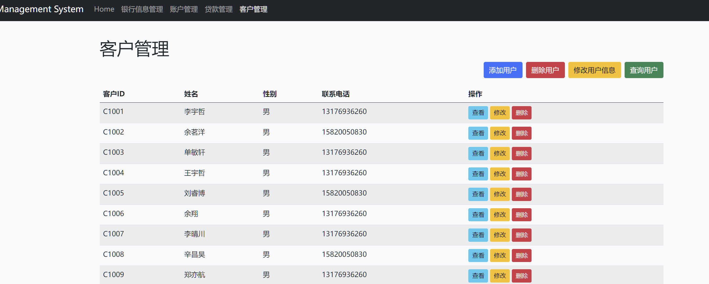

客户管理，支持查看客户具体信息，查询，删除，修改，添加等

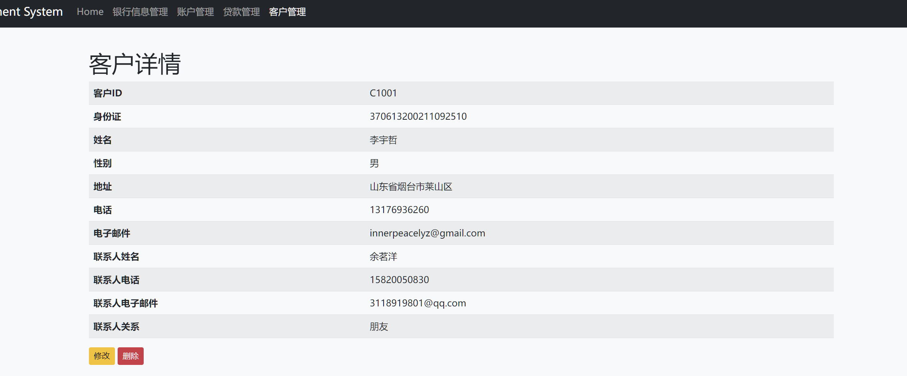

## 参考

> 如前端使用的模板、引用的图片来源、第三方库的官网等等

前端模版 

bootstrap

- "https://cdn.staticfile.net/twitter-bootstrap/5.1.1/css/bootstrap.min.css" 
- https://cdn.staticfile.net/twitter-bootstrap/5.1.1/js/bootstrap.bundle.min.js

图片来源，google搜索中国各高校校徽，clone仓库后已经存入media文件下

Django使用教程

https://docs.djangoproject.com/zh-hans/4.2/intro/install/